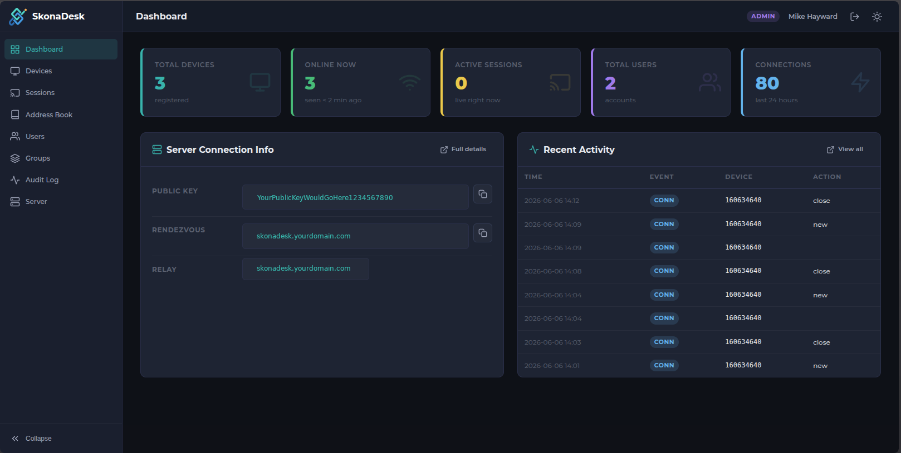
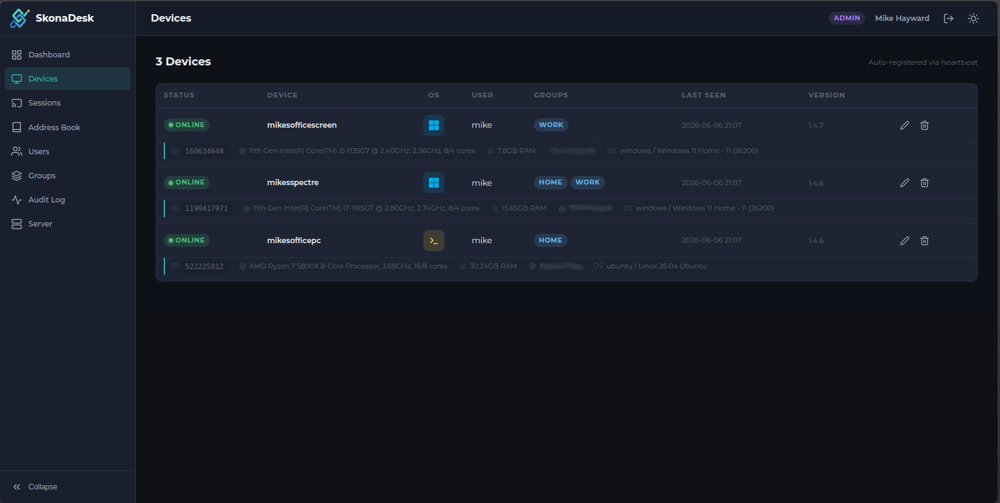

<p align="center">
  
</p>

<h1 align="center">SkonaDesk</h1>

<p align="center">
  <strong>Self-hosted remote desktop management — pro features, zero subscription.</strong><br>
  Built on the open-source <a href="https://rustdesk.com">RustDesk</a> server. Works with <strong>standard, unmodified RustDesk clients</strong> on Windows, macOS, Linux, iOS, and Android.
</p>

<p align="center">
  <a href="LICENSE"></a>
  <a href="https://github.com/Skonamonkey?tab=packages"></a>
  <a href="https://buymeacoffee.com/skonamonkey"></a>
</p>

<p align="center">
  <a href="README.pt-BR.md">[Português (Brasil)]</a>
</p>

---

## What is SkonaDesk?

RustDesk is an open-source remote desktop tool. The OSS server handles rendezvous and relay well, but ships without an API layer — so features like address books, device groups, and shared peer lists simply don't exist unless you add them yourself or pay for [RustDesk Server Pro](https://rustdesk.com/docs/en/self-host/rustdesk-server-pro/).

SkonaDesk fills that middle ground. It's a self-hosted stack that adds the management layer on top of the OSS server — address books, groups, relay auth, and an admin dashboard — without requiring a Pro licence. It runs on your own hardware: a VPS, a Proxmox VM, a NUC under the stairs, whatever you've got.

**One `docker compose up` and you have:**

- 📋 **Address books** — organise your machines with aliases, notes, and tags, synced directly to the RustDesk client
- 🗂️ **Device groups** — group machines by location, team, or purpose; control who can see what
- 👥 **User management** — create accounts, set admins, manage access
- 📡 **Live device tracking** — see which machines are online right now, their OS, client version, and hardware specs
- 🔒 **Relay authentication** — only logged-in users can initiate connections; anonymous relay abuse is blocked at the Rust level
- 📊 **Admin dashboard** — clean web UI with light/dark mode, live stats, audit log, and active session monitoring
- 🔗 **Active sessions view** — see exactly who is connected to what, in real time

No subscription. No vendor lock-in. Your data stays on your hardware.

---

## Who is SkonaDesk for?

**SkonaDesk is a great fit if you are:**

- A homelab enthusiast who wants proper remote desktop management without a recurring bill
- A small team or small business that needs address books and device grouping but doesn't need enterprise-grade identity management or policy controls
- An IT pro or sysadmin managing a handful of machines for clients who wants a lightweight, self-hosted solution
- Someone already running the RustDesk OSS server who wants to add the management layer on top

**You should consider [RustDesk Server Pro](https://rustdesk.com/pricing.html) if you need:**

- OIDC / LDAP / Active Directory integration
- Two-factor authentication
- Fine-grained access control policies (who can connect to what)
- Multiple geographically distributed relay servers
- Custom client generator (pre-configured installers)
- SMTP email notifications and alarms
- Web client self-hosting
- Commercial support

RustDesk Pro is also self-hosted — it's not a cloud service. It's a genuinely excellent product for teams that need those features. SkonaDesk is for the space between the bare OSS server and full Pro: small deployments that just need address books, groups, and an admin view without the overhead of a full enterprise stack.

---

## Features

| Feature | SkonaDesk | RustDesk OSS | RustDesk Pro |
|---------|:---------:|:------------:|:------------:|
| Remote desktop (relay + rendezvous) | ✅ | ✅ | ✅ |
| Self-hosted | ✅ | ✅ | ✅ |
| Address books (synced to client) | ✅ | ❌ | ✅ |
| Device groups | ✅ | ❌ | ✅ |
| User management | ✅ | ❌ | ✅ |
| Admin dashboard / web console | ✅ | ❌ | ✅ |
| Active sessions view | ✅ | ❌ | ✅ |
| Audit / connection log | ✅ | ❌ | ✅ |
| Relay authentication | ✅ | ❌ | ✅ |
| Device hardware info (CPU/RAM/OS) | ✅ | ❌ | ✅ |
| OIDC / LDAP / 2FA | ❌ | ❌ | ✅ |
| Access control policies | ❌ | ❌ | ✅ |
| Multiple relay servers (geo) | ❌ | ❌ | ✅ |
| Custom client generator | ❌ | ❌ | ✅ |
| SMTP / email notifications | ❌ | ❌ | ✅ |
| Web client self-hosting | ❌ | ❌ | ✅ |
| Licence cost | Free | Free | Paid (per user) |

---

## Screenshots

<p align="center">
  
  <br><em>Live stats dashboard with device status, active sessions, and recent activity</em>
</p>

<p align="center">
  
  <br><em>Device management — OS icons, client version, CPU, RAM, and WAN IP at a glance</em>
</p>

---

## Quick Install

If you're on a fresh Linux server with Docker installed, the interactive installer handles everything:

```bash
curl -fsSL https://raw.githubusercontent.com/Skonamonkey/skonadesk/main/install.sh -o install.sh && bash install.sh
```

The script will ask for your domain (or IP), generate secure secrets, write your `.env`, and start the stack.

---

## Proxmox LXC Install *(one-liner)*

Run the following directly on your Proxmox host. It creates a Debian 12 LXC container, installs Docker, and sets up the full SkonaDesk stack interactively — prompting you for server address, dashboard port, and admin credentials.

```bash
bash -c "$(curl -fsSL https://raw.githubusercontent.com/Skonamonkey/skonadesk/main/proxmox/ct/skonadesk.sh)"
```

The installer auto-detects the container's IP as the default server address. If you plan to put it behind a reverse proxy, enter your domain at the prompt instead of accepting the IP default.

Once complete, the dashboard URL and firewall port requirements are printed to the terminal.

> **Updating:** Re-run the same one-liner on the Proxmox host and choose the update option, or from inside the LXC:
> ```bash
> cd /srv/skonadesk && docker compose pull && docker compose up -d --force-recreate
> ```

## Manual Install

### Step 1 — Clone the stack and configure

```bash
git clone https://github.com/Skonamonkey/skonadesk.git /srv/skonadesk
cd /srv/skonadesk
cp .env.example .env
nano .env
```

This repo contains the API, dashboard, and Docker Compose configuration. The patched `hbbs` binary is **not** compiled here — it's a pre-built image (`ghcr.io/skonamonkey/skonadesk-hbbs:latest`) pulled from the [skonadesk-hbbs](https://github.com/Skonamonkey/skonadesk-hbbs) repo. Docker pulls it automatically when you start the stack in Step 3. No separate build step is needed.

### Step 2 — Configure `.env`

**With a domain and SSL (recommended for internet-facing deployments):**

```env
RELAY_HOST=your.domain.com
DOMAIN=your.domain.com
API_PUBLIC_URL=https://your.domain.com

JWT_SECRET=<run: openssl rand -hex 32>
APP_SECRET=<run: openssl rand -hex 32>

ADMIN_USER=yourname          # do NOT use 'admin'
ADMIN_PASS=a-strong-password

DB_PATH=/data/skonadesk.db
PORT=21114
```

**With an IP address or DDNS hostname (no SSL):**

```env
RELAY_HOST=192.168.1.50      # or your.ddns.net
DOMAIN=192.168.1.50
API_PUBLIC_URL=http://192.168.1.50:21114

JWT_SECRET=<run: openssl rand -hex 32>
APP_SECRET=<run: openssl rand -hex 32>

ADMIN_USER=yourname
ADMIN_PASS=a-strong-password

DB_PATH=/data/skonadesk.db
PORT=21114
```

Generate secure secrets with:
```bash
openssl rand -hex 32
```

### Step 3 — Start the stack

```bash
docker compose -f docker-compose.prod.yml up -d
```

Check everything is running:

```bash
docker compose -f docker-compose.prod.yml ps
```

You should see four containers: `skonadesk-hbbs`, `skonadesk-hbbr`, `skonadesk-api`, `skonadesk-dashboard`.

### Step 4 — SSL setup (if using a domain)

Add two proxy hosts in [Nginx Proxy Manager](https://nginxproxymanager.com) (or any reverse proxy):

| Domain | Forward hostname | Forward port | SSL |
|--------|-----------------|--------------|-----|
| `your.domain.com` | `skonadesk-api` | `21114` | Let's Encrypt |
| `dashboard.your.domain.com` | `skonadesk-dashboard` | `80` | Let's Encrypt |

> **NPM must be on the same Docker network** to resolve `skonadesk-api` and `skonadesk-dashboard` by hostname. SkonaDesk creates a network named `skonadesk`. You have three options:
>
> **Option A — Edit NPM's compose file (recommended, persistent):**
> ```yaml
> networks:
>   skonadesk:
>     external: true
>
> services:
>   app:
>     # ... your existing NPM config ...
>     networks:
>       - default
>       - skonadesk
> ```
> Then restart NPM: `docker compose down && docker compose up -d`
>
> **Option B — Quick one-liner (not persistent across NPM container restarts):**
> ```bash
> docker network connect skonadesk npm
> ```
> This works immediately with no restart, but is lost if the NPM container is ever recreated.
>
> **Option C — Skip Docker networking entirely:** Use the host IP and mapped ports (`YOUR-SERVER-IP:21114` and `YOUR-SERVER-IP:8080`) as the forward targets in NPM instead of container hostnames.

No SSL? Skip this step — access the dashboard at `http://YOUR-IP:8080`.

### Step 5 — Configure the RustDesk client

Open the **Server** page in the dashboard — it shows your public key and pre-filled client settings with copy buttons.

Or configure manually in the RustDesk client under **Settings → Network:**

| Field | SSL (domain) | No SSL (IP/DDNS) |
|-------|-------------|------------------|
| ID/Relay Server | `your.domain.com` | `192.168.1.50` |
| API Server | `https://your.domain.com` | `http://192.168.1.50:21114` |
| Key | *(from dashboard Server page)* | *(from dashboard Server page)* |

---

## Deployment Scenarios

### Scenario A — VPS with domain + SSL *(recommended for API transport security)*

A reverse proxy (Nginx Proxy Manager is the easiest choice) terminates HTTPS and forwards to the API and dashboard containers. All traffic between clients and the API is encrypted in transit.

> **Note on dashboard exposure:** On a public VPS the dashboard is internet-facing, which is a larger attack surface than a home LAN deployment. For tighter security, restrict dashboard access to a VPN or firewall allowlist so only you can reach it — the API must remain publicly reachable for clients, but the dashboard does not.

**Firewall / hosting panel — open these ports:**

| Port | Protocol | Purpose |
|------|----------|---------|
| 21115 | TCP | NAT type test |
| 21116 | TCP + UDP | Rendezvous (hbbs) |
| 21117 | TCP | Relay (hbbr) |
| 21118 | TCP | WebSocket rendezvous |
| 21119 | TCP | WebSocket relay |
| 443 | TCP | API + Dashboard (reverse proxy) |
| 80 | TCP | HTTP → HTTPS redirect |

No port forwarding needed on a VPS — your hosting panel's firewall handles it.

### Scenario B — Home server / Proxmox VM exposed to the internet

Forward these ports from your router to the machine's LAN IP:

| External | Internal | Protocol | Purpose |
|----------|----------|----------|---------|
| 21115 | 21115 | TCP | NAT type test |
| 21116 | 21116 | TCP + UDP | Rendezvous |
| 21117 | 21117 | TCP | Relay |
| 21118 | 21118 | TCP | WebSocket rendezvous |
| 21119 | 21119 | TCP | WebSocket relay |
| 443 | 443 | TCP | API + Dashboard via reverse proxy *(SSL — recommended)* |
| 21114 | 21114 | TCP | API direct *(no SSL only — see note below)* |
| 8080 | 8080 | TCP | Dashboard direct *(no SSL only — not recommended externally)* |

> **Important:** Port 21114 (API) **must be reachable by every connecting client** — it is required for JWT relay authentication. Without it, clients can register with the rendezvous server but the relay will reject their connections (they'll hang on "Connecting..."). Forwarding 21115–21119 without 21114 achieves nothing for external clients.
>
> **Security tip:** The strongly recommended approach is to put the API behind a reverse proxy with SSL (port 443) — then you do *not* forward port 21114 directly. Port 8080 (dashboard) should always be kept LAN-only or VPN-only; regular RustDesk clients never need dashboard access.

### Scenario C — LAN only / VPN only

The simplest option. No port forwarding, no domain, no SSL. All clients connect to the machine's LAN IP. Perfect for an office where all machines are on the same network, or any setup where remote access goes through a VPN first.

---

## Security & Hardening

SkonaDesk is provided as-is. You are responsible for securing your own deployment.

### Minimum checklist

- [ ] Set a non-obvious `ADMIN_USER` (not `admin` — it's the first thing attackers try)
- [ ] Use a strong `ADMIN_PASS` and rotate it after setup
- [ ] Generate random values for `JWT_SECRET` and `APP_SECRET` with `openssl rand -hex 32`
- [ ] For internet-facing deployments, use SSL — do not expose the API or dashboard over plain HTTP on a public IP
- [ ] Restrict SSH on your server: key-based auth only, disable password login
- [ ] Back up `./data/id_ed25519` (the server private key) — if lost, all clients need reconfiguring
- [ ] Keep Docker images updated periodically

### Brute-force protection

The API enforces login rate limiting per **IP + username** combination:

- **5 failed attempts** within 15 minutes triggers a 15-minute lockout for that IP/username pair
- Successful login immediately clears the counter
- Lockout events are logged: `docker logs skonadesk-api | grep brute-force`
- Locked-out clients receive HTTP 429: *"Too many failed attempts. Try again in N minute(s)."*

Keying on IP+username (rather than IP alone) means a misconfigured device on your LAN retrying with wrong credentials will only lock out *that username* from *that IP* — not every user across the whole network.

> **Note:** The lockout state is in-memory and resets if the API container restarts. For persistent lockouts across restarts, sit a reverse proxy with its own rate limiting (e.g. Nginx Proxy Manager's built-in limits) in front.

### What SkonaDesk does not provide

- **Per-peer access control** — any authenticated user can attempt to connect to any device they know the ID of. Device-level passwords set in the RustDesk client are the only per-device restriction.
- **Multi-factor authentication**
- **Session content auditing** — connections are end-to-end encrypted between peers; the server can't see what was transmitted

### Relay auth behaviour

The patched `hbbs` validates a JWT token in every `PunchHoleRequest`. Clients without a valid login token receive a `LICENSE_MISMATCH` response before any relay traffic flows.

### Client configuration matrix

Not every machine needs the same configuration. This table shows exactly what works and why — verified against the patched `hbbs` source code.

| Caller: Server | Caller: JWT | Caller: Key | Callee: Server | Callee: JWT | Callee: Key | Result |
|:---:|:---:|:---:|:---:|:---:|:---:|---|
| ✅ | ✅ | ✅ | ✅ | ➖ | ✅ | ✅ Works — both rendezvous channels encrypted |
| ✅ | ✅ | ✅ | ✅ | ➖ | ❌ | ✅ Works — caller encrypted, callee plaintext rendezvous |
| ✅ | ✅ | ❌ | ✅ | ➖ | ✅ | ✅ Works — callee encrypted, caller plaintext rendezvous |
| ✅ | ✅ | ❌ | ✅ | ➖ | ❌ | ✅ Works — both rendezvous channels plaintext |
| ✅ | ❌ | ✅ | ✅ | ➖ | ✅ | ❌ **Blocked** — caller has no JWT, rejected at rendezvous |
| ✅ | ❌ | ❌ | ✅ | ➖ | ✅ | ❌ **Blocked** — caller has no JWT, rejected at rendezvous |
| ✅ | ✅ | ✅ | ❌ | ➖ | ➖ | ❌ **Blocked** — callee not registered, appears offline |
| ❌ | ➖ | ➖ | ✅ | ➖ | ✅ | ❌ **Blocked** — caller can't reach rendezvous server |

**Key:**
- **➖** = not applicable / has no effect on the outcome
- **Callee JWT** is always ➖ — the callee (machine being connected *to*) never needs to be logged in
- **Key** controls transport encryption on the rendezvous channel only — it does not gate connections
- **Peer-to-peer session content is always E2E encrypted** regardless of key configuration — that is a separate mechanism between the two clients directly

**Why the key and HTTPS are strongly recommended even though connections work without them:**

The JWT token travels inside every `PunchHoleRequest` on the rendezvous channel. Without the key configured on the caller, that channel is plaintext — the JWT is visible on the wire. An intercepted JWT gives an attacker 7 days of relay access (the token lifetime). Without HTTPS on the API, your password and JWT are also visible at the point of login — an intercepted password gives permanent access until changed.

| Channel | Without protection — attacker sees | Consequence |
|---|---|---|
| **API without HTTPS** | Password + JWT token | Permanent account access + 7-day relay access |
| **Caller rendezvous without key** | JWT in `PunchHoleRequest` | 7-day relay access |
| **Callee rendezvous without key** | Peer ID, hostname, OS, timing | Reconnaissance only — no credential risk |

None of these are enforced — connections work without them. But the marginal effort to configure the key on both sides and enable HTTPS is trivial, and the protection is real.

---

## Troubleshooting

### "Too many failed attempts" / cannot log in

The API's brute-force protection has locked out your IP+username combination after 5 failed login attempts. Wait 15 minutes for the lockout to expire, or restart the API container to clear it immediately:

```bash
docker compose restart api
```

To see which IPs have been locked out:
```bash
docker logs skonadesk-api | grep brute-force
```

### "Key mismatch" error

- The caller is not logged in to the API. Log in via the RustDesk client (the key/person icon in the top-right) and try again.
- Double-check the Key field in RustDesk Settings → Network matches the key shown on the dashboard Server page.

### "Failed to secure tcp / deadline elapsed"

- The `hbbs` container is running the stock `rustdesk/rustdesk-server` image instead of the patched `skonadesk-hbbs`. Verify with:
  ```bash
  docker inspect skonadesk-hbbs --format '{{.Config.Image}}'
  ```
  It should show `skonadesk-hbbs:latest` (or the GHCR path), not `rustdesk/rustdesk-server:latest`.

### Cannot connect to dashboard

- Verify `skonadesk-dashboard` is running: `docker compose ps`
- Check the API is reachable: `curl http://localhost:21114/api/login-options`
- For SSL setups, confirm the NPM proxy host points to `skonadesk-api:21114` (not the dashboard port)

### Devices not appearing / showing as offline

- The device must have the correct API Server address configured in RustDesk Settings → Network
- The device sends heartbeats every 3 seconds. If it has not been seen in the last 2 minutes it shows as offline.
- Check API logs: `docker logs skonadesk-api --tail 50`

### Changing admin password after first run

```bash
docker exec -it skonadesk-api node -e "
const db = require('./db').getDb();
const bcrypt = require('bcryptjs');
db.prepare(\"UPDATE users SET password=? WHERE username=?\")
  .run(bcrypt.hashSync('new-password', 10), 'youradminname');
console.log('done');
"
```

---

## Technical Details

### Why a patched hbbs is needed

The stock RustDesk OSS `hbbs` binary has two behaviours that break third-party API integrations:

**Bug 1 — "Failed to secure tcp: deadline elapsed"**

When a RustDesk client has an active API session it calls `secure_tcp()` before sending a `PunchHoleRequest`. This waits up to 18 seconds for the server to send a `KeyExchange` message. The stock `hbbs` never initiates one — it waits for the client. Both sides wait forever → timeout → connection fails.

*Fix:* The patched hbbs implements the proper two-phase `KeyExchange` handshake. On each new TCP connection the server signs its ephemeral public key with the server signing key and sends it to the client (phase 1). The client responds with its own ephemeral public key sealed against the server's key (phase 2). Both sides derive a shared symmetric key (XSalsa20-Poly1305 via libsodium) and all subsequent rendezvous traffic on that connection is encrypted. This is equivalent to the approach used in lejianwen's fork and is the correct solution to the original deadlock.

**Bug 2 — "Key mismatch" on Windows clients**

Standard Windows RustDesk binaries read the licence key from the embedded binary before checking the user's config file. That embedded key (`OeVuKk5nlHiXp+APNn0Y3pC1Iwpwn44JGqrQCsWqmBw=`) will never match any custom server's key.

*Fix:* The licence key check is skipped entirely. Authentication is provided by JWT relay auth instead.

**Transport encryption:** The rendezvous TCP channel between client and `hbbs` is transport-encrypted via the KeyExchange handshake described above. End-to-end encryption between peers is unaffected (it happens at the peer level independently). If you also use SSL via a reverse proxy, the client-to-proxy leg is encrypted at the TLS layer as well.

### Architecture

```
RustDesk Client
      │
      ├── TCP :21116 / UDP :21116 ──► skonadesk-hbbs  (patched rendezvous)
      │                                   │ JWT validation on every PunchHoleRequest
      ├── TCP :21117 ───────────────► skonadesk-hbbr  (stock relay)
      │
      ├── HTTPS :443 ──► Nginx Proxy Manager ──► skonadesk-api       :21114
      │                                      └──► skonadesk-dashboard :8080
      │
      └── WebSocket :21118 ──► skonadesk-hbbs
```

### Stack file layout

```
skonadesk/
├── .env.example
├── docker-compose.yml          # dev (local builds)
├── docker-compose.prod.yml     # prod (GHCR images)
├── install.sh                  # interactive one-shot installer
├── api/                        # Node.js API server (port 21114)
│   ├── Dockerfile
│   ├── server.js
│   ├── db.js
│   ├── auth.js
│   └── routes/
│       ├── login.js            # auth, heartbeat
│       ├── ab.js               # address book (14 endpoints)
│       ├── heartbeat.js
│       └── admin.js            # users, peers, groups, stats, sessions
└── dashboard/                  # PHP 8.2 admin UI
    ├── Dockerfile
    ├── home.php                # live stats dashboard
    ├── devices.php             # device list with OS/hardware info
    ├── sessions.php            # active sessions monitor
    ├── addressbook.php
    ├── users.php
    ├── groups.php
    ├── audit.php
    ├── server.php              # public key + client setup guide
    ├── profile.php             # password change
    └── includes/
        ├── config.php
        ├── auth.php
        ├── api.php
        └── layout.php
```

### Building the patched hbbs from source

Pre-built images are provided via GHCR. If you want to build from source (e.g. to audit or modify the patches):

```bash
git clone https://github.com/Skonamonkey/skonadesk-hbbs.git
cd skonadesk-hbbs
git submodule update --init --recursive
docker build --no-cache -f Dockerfile.skonadesk -t skonadesk-hbbs:latest .
```

Build time: ~2 minutes with Docker layer cache; ~10 minutes cold on a modern machine.

To transfer to a remote server:

```bash
docker save skonadesk-hbbs:latest | gzip > /tmp/skonadesk-hbbs.tar.gz
scp /tmp/skonadesk-hbbs.tar.gz user@your-server:/tmp/
# On server:
docker load < /tmp/skonadesk-hbbs.tar.gz
```

---

## Project Status & Maintenance

SkonaDesk is a **community-maintained, spare-time project** by a solo developer. It is stable, actively used in production, and works well as-is — but this is not a full-time product with a roadmap and release schedule.

**What you can expect:**
- Security patches applied as soon as practically possible
- Bug fixes when reported and reproducible
- Feature requests considered and implemented when time allows
- The `hbbr` relay is intentionally pinned to a specific RustDesk release (currently `1.1.15`) rather than `latest`, so automatic upstream changes cannot silently break your installation

**What to set your expectations around:**
- Response times on issues/PRs may vary — real life comes first
- There is no commercial support offering
- If it's working for you, there is no pressure to update — *"if it ain't broke, don't fix it"* is a perfectly valid strategy here
- **ARM64 (`linux/arm64`) images are published** but are community best-effort — I don't have ARM hardware to test on, so ARM-specific issues may take longer to diagnose or may need community help to reproduce

If you find it useful, the best way to help the project is to open issues for bugs, submit PRs for fixes, and spread the word in homelab communities. Contributions are always welcome.

---

## Credits & Licence

SkonaDesk is built on the [RustDesk open-source server](https://github.com/rustdesk/rustdesk-server). The protocol, protobuf definitions, and core rendezvous/relay logic are RustDesk's work. This project adds the API and dashboard layer and patches the two bugs described above that prevent any third-party API from working with the stock client.

RustDesk is © RustDesk Ltd and contributors, licensed under AGPL-3.0.
SkonaDesk is © Skonamonkey and contributors, licensed under [AGPL-3.0](LICENSE).

If SkonaDesk saves you money, consider [supporting the RustDesk project](https://github.com/sponsors/rustdesk) — they built the foundation this runs on.

If SkonaDesk has been useful to you, you can also [buy me a coffee](https://buymeacoffee.com/skonamonkey) — it's appreciated but never expected.
